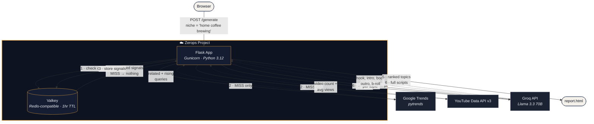
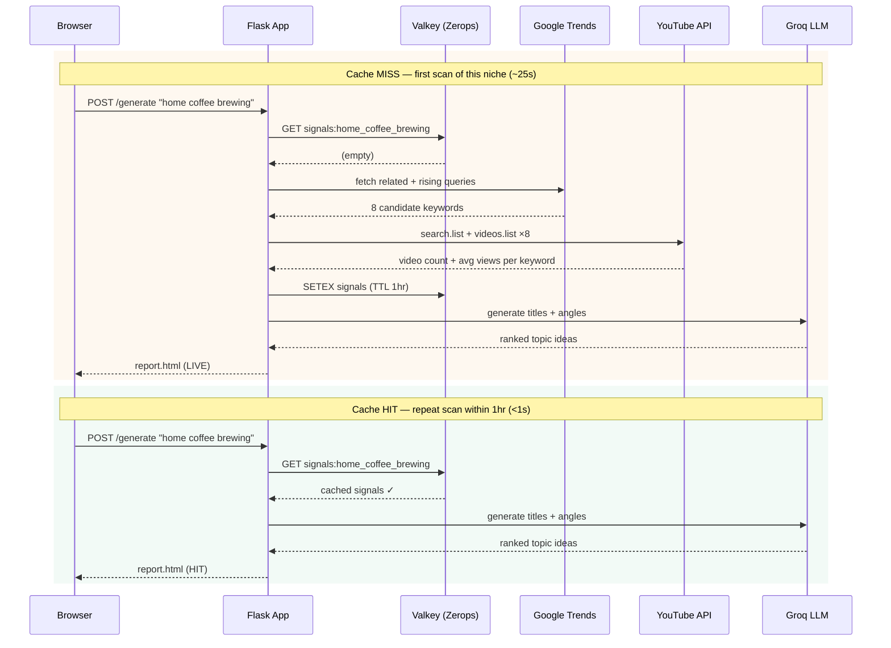
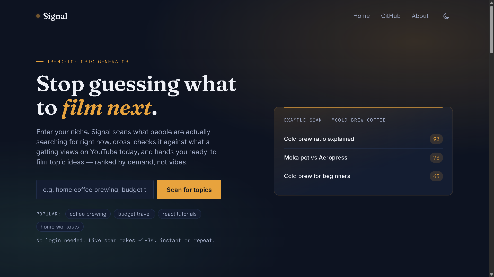
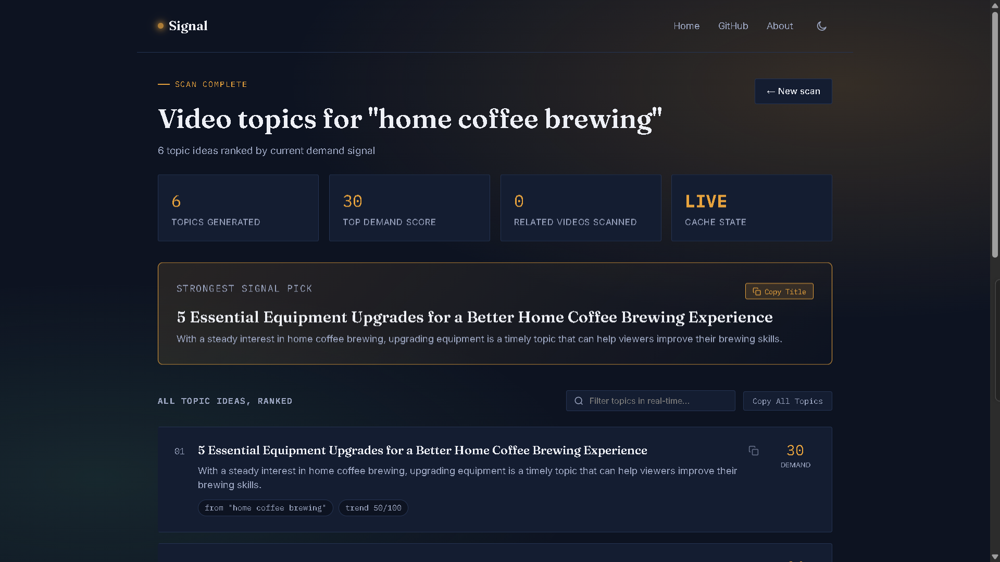
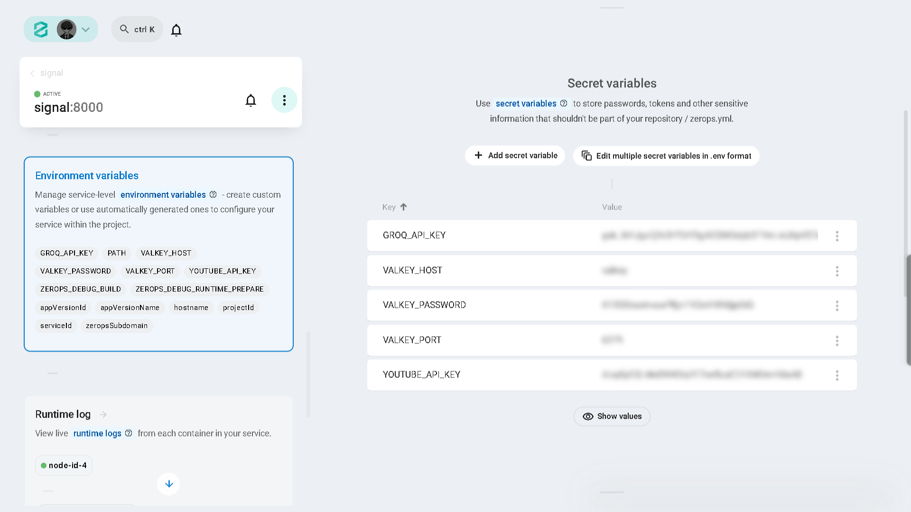
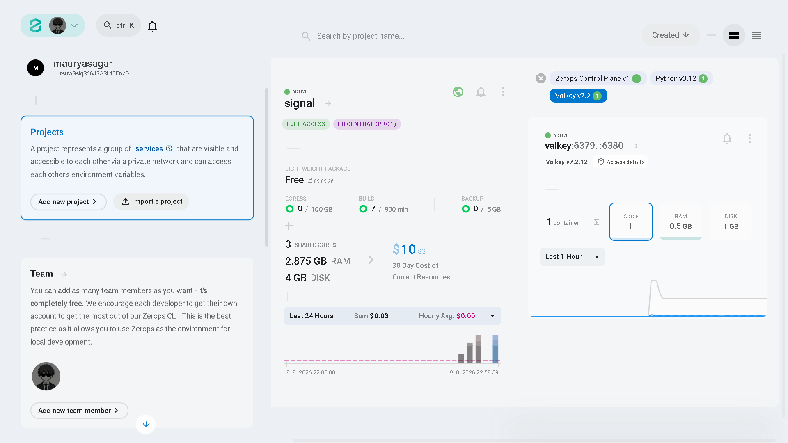
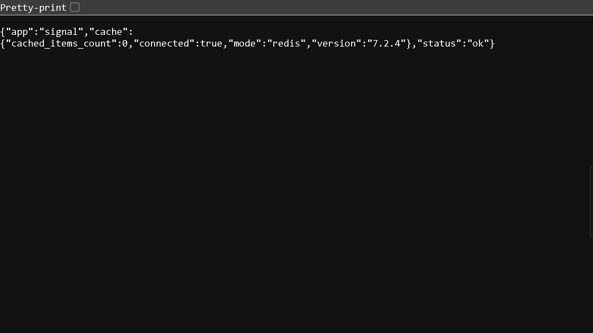

<div align="center">

# Signal — YouTube Content Automation Pipeline

**Stop guessing what to film next.** Signal automates your entire YouTube pre-production pipeline: it finds trending search demand, generates ready-to-film video titles, and with one click, writes the full video script and B-roll shot list.

Built for the **Social Media Automation Hacks** on Devpost

[🚀 Live Demo](https://signal-2dc6-8000.prg1.zerops.app) &nbsp;•&nbsp; [📝 Blog](https://dev.to/sagarmaurya/how-i-built-a-youtube-trend-engine-on-zerops-hka)

</div>

---

## The problem it solves

Most YouTube content advice is generic — "post consistently," "use trending sounds," "add numbers to your title." None of it is specific to your niche, and none of it actually writes the video for you.

Signal automates the entire brainstorming and scripting workflow:
- Looks at what people are **actually searching** in your specific niche right now
- Cross-references it with what's **getting views on YouTube today**
- Uses an LLM to turn raw keywords into **concrete, ready-to-film video titles**
- **[NEW]** Automates scriptwriting: One click generates a full video script (Hook, Intro, Body, Outro) and a B-roll visual shot list.
- Ranks everything by a **demand score** so you know where to start

No login. No subscription. Paste a niche, get a complete video blueprint in ~30 seconds.

---

## Architecture

**What lives on Zerops vs what's external** — the cache layer is the main infra story here, so it's drawn as its own boundary rather than buried as step 1 of a pipeline.



**Everything inside the Zerops boundary is infra we control and deploy together** — the Flask app and Valkey cache live in the same project, talking over the internal network. Trends, YouTube, and Groq are external APIs the app calls out to. The cache is what turns steps 2–3 from "always happens" into "only on a miss" — which is the whole point of it being there.

### Cache HIT vs MISS — why it matters

The same request takes a fundamentally different path depending on whether Valkey has seen this niche in the last hour. This is the clearest way to see the caching layer actually doing something rather than just sitting there:



Note that the Groq call always runs fresh — only the Trends/YouTube signal data is cached, so topic titles never go stale even when the underlying demand data is reused.

---

## How each step works

### Step 1 — Zerops Valkey cache check
Before hitting any external API, Signal checks if this niche was already scanned in the last hour. On a **cache hit**, steps 2–3 are skipped entirely — response drops from ~25s to under 1s. The report page shows a **HIT** or **LIVE** badge in the stats strip so you can see it working.

### Step 2 — Google Trends (pytrends)
Pulls **rising** and **top** related search queries for the niche over the last 3 months. Returns up to 8 queries with a relative interest score (0–100). pytrends is an unofficial wrapper — if Google rate-limits it, Signal automatically falls back to seeded keywords (`"{niche} tips"`, `"best {niche}"`, etc.) so the pipeline never fully breaks.

### Step 3 — YouTube Data API v3
For each query from Trends, Signal calls `search.list` to find the top 5 most-viewed recent videos (published after August 2025). Then calls `videos.list` to get their view counts and compute an average. This gives a real-world signal of what's actively being made and watched. Each call costs 100 API units against the 10K/day free quota.

### Step 4 — Groq LLM (Llama 3.3 70B) Topic Ideation
Sends all signals to Llama 3.3 70B via the Groq API with a structured prompt. The model receives each keyword + its demand indicators and returns a JSON array — one entry per signal — with a **video title** and a one-line **angle** explaining why it could work. Groq's free tier has no credit card requirement and handled this reliably in testing.

### Step 5 — Demand score + ranking
Each topic gets a 0–100 demand score:

```
demand_score = (trend_interest × 0.60)
             + (min(video_count / 5, 1) × 100 × 0.25)
             + (log10(avg_views + 1) / 7 × 100 × 0.15)
```

- **60% trend interest** — how much search momentum the query has right now
- **25% video count** — how many creators are actively making this content (competition signal)
- **15% avg views (log-scaled)** — how large the audience is; log scale prevents one viral outlier dominating

Topics are sorted by demand score descending. The top topic gets a highlighted banner.

### Step 6 — Automated Script Generation (On-Demand)
When a creator clicks "Generate Full Script & B-Roll" on a topic card, an asynchronous AJAX request is sent to the backend. Llama 3.3 70B takes the title and angle and automatically drafts a complete, ready-to-film script. It returns a structured JSON object containing a 15-second Hook, Intro, main Body bullet points, an Outro with a Call-to-Action, and a list of visual B-roll ideas for the editor. This completely automates the scriptwriting phase of content creation.

---

## Tech stack

| Component | Technology | Why |
|---|---|---|
| Web server | Flask + Gunicorn | Lightweight, easy to template, production-safe with Gunicorn |
| Trend data | Google Trends via `pytrends` | No API key needed; free unofficial wrapper |
| YouTube demand | YouTube Data API v3 | Official API, free 10K quota/day, real view data |
| LLM | Groq — Llama 3.3 70B | Free tier, no card required, fast inference |
| Cache | Zerops Valkey (Redis-compatible) | Reduces API calls on repeat queries; meaningful Zerops integration |
| Deployment | **Zerops** | Production infra, live URL, stays up through judging |
| Frontend | Jinja2 + vanilla CSS/JS | No build step, no framework, nothing to break |

---

## Project structure

```
signal/
├── app.py                  # Flask routes: /, /about, /generate, /generate_script, /health
├── report.py               # Pipeline orchestration + demand score
├── fetch_trends.py         # Google Trends + YouTube API calls
├── generate_topics.py      # Groq LLM calls (Topics + Scripts) + JSON parsing
├── cache.py                # Zerops Valkey integration (fails soft if not configured)
├── zerops.yaml             # Zerops build + run configuration
├── requirements.txt
├── .env.example
├── .gitignore
├── README.md
├── templates/
│   ├── base.html           # Shared nav, footer, radar loading animation
│   ├── landing.html        # Home page + search form
│   ├── report.html         # Ranked topic cards + on-demand script generation UI
│   └── about.html          # How it works page
└── static/
    ├── style.css           # Dark/light theme via CSS vars + data-theme attribute
    └── main.js             # Theme toggle, loading overlay, dynamic script generation
```

---

## Screenshots

| Dashboard | Topic Report |
| :---: | :---: |
|  |  |

| Zerops Environment Variables | Zerops Architecture Deploy |
| :---: | :---: |
|  |  |

| Valkey Health Check |
| :---: |
|  |

---

## Running locally

### Prerequisites
- Python 3.11 or higher
- A YouTube Data API v3 key ([get one free](https://console.cloud.google.com/apis/credentials))
- A Groq API key ([get one free](https://console.groq.com/keys), no card needed)

### Setup

```bash
# 1. Clone the repo
git clone https://github.com/mauryasagar/signal
cd signal

# 2. Install dependencies
pip install -r requirements.txt

# 3. Add your API keys
cp .env.example .env
# Open .env and fill in YOUTUBE_API_KEY and GROQ_API_KEY

# 4. Run
python app.py

# Open http://localhost:8000
```

Valkey is not needed locally — the app runs without caching if `VALKEY_HOST` is empty. Everything works, just no cache.

---

## Deploying on Zerops

### 1. Create a Zerops account
Sign up at [zerops.io](https://zerops.io) — free, $15 in credits included.

### 2. Create a project with two services
In the Zerops dashboard:
- Add a **Python** service → name it `signal`
- Add a **Valkey** service → name it `valkey`

### 3. Set environment variables
In the Signal service's environment panel:

```
YOUTUBE_API_KEY=your_key_here
GROQ_API_KEY=your_key_here
VALKEY_HOST=valkey
VALKEY_PORT=6379
VALKEY_PASSWORD=
```

### 4. Deploy
Connect your GitHub repo to Zerops and push. Zerops reads `zerops.yaml` automatically and handles the build + deploy. Or use the CLI:

```bash
npm install -g @zerops/zcli
zcli login
zcli push
```

### 5. Verify
Hit `/health` on your live URL:

```json
{
  "status": "ok",
  "app": "signal",
  "cache": { "connected": true, "version": "7.2.x" }
}
```

`"connected": true` confirms Valkey is wired up correctly.

---

## Environment variables reference

| Variable | Required | Description |
|---|---|---|
| `YOUTUBE_API_KEY` | ✅ Yes | YouTube Data API v3 key. Enable the API in Google Cloud Console first. |
| `GROQ_API_KEY` | ✅ Yes | Groq API key. Free at console.groq.com, no billing needed. |
| `VALKEY_HOST` | Zerops only | Hostname of your Zerops Valkey service. Leave blank locally. |
| `VALKEY_PORT` | Zerops only | Default `6379`. |
| `VALKEY_PASSWORD` | Zerops only | Leave blank if no auth configured. |
| `FLASK_DEBUG` | Optional | Set `true` for local debugging. Always `false` in production. |
| `PORT` | Optional | Port to bind to. Defaults to `8000`. |

---

## Known limitations

**Demand score is directional, not exact.** No free data source provides real search volume — the score combines relative trend interest and YouTube activity as a proxy. Treat it as a compass, not a guarantee.

**pytrends is unofficial.** Google Trends has no public API. pytrends can be rate-limited or break without warning. Signal falls back to seeded keywords automatically, so the app never fully fails, but Trends data quality may vary.

**YouTube API quota.** Each `search.list` call costs 100 units. The free quota is 10,000 units/day, meaning roughly ~100 full scans per day. Zerops Valkey caching reduces this significantly since repeat niches skip the API entirely.

**Avg views can look inflated.** Search results are sorted by view count, so the top 5 videos tend to be outlier performers. This makes the avg_views number higher than what a new creator would realistically get — it's a ceiling signal, not a realistic expectation.

---

## AI tools used

- **Claude (Anthropic)** — architecture decisions, code generation, README
- **Groq / Llama 3.3 70B** — runtime LLM for topic & script generation (part of the product itself)

All code reviewed and understood by the author. Architecture and implementation decisions are original.

---

## License

MIT